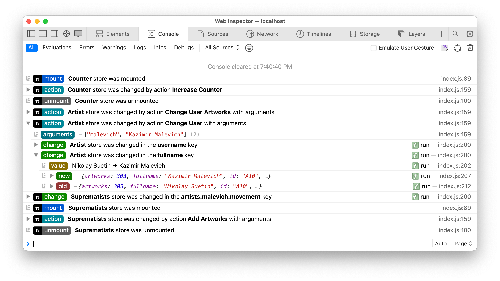

# Nano Stores Logger


Logger of lifecycles and changes for **[Nano Stores]**,
a tiny state manager with many atomic tree-shakable stores.

* **Clean.** All messages are stacked in compact, collapsible nested groups.
* **Descriptive.** Detailed descriptions with a clear comparison of the old and new values.
* **Pretty designed.** Compact logo and color badges for quick reading.
* **Flexible.** Ability to disable and filter certain types of messages.
* **Supports all types of stores**: Atom, Map and Deep Map.

[Nano Stores]: https://github.com/nanostores/nanostores/

<p align="center">
  <picture>
    <source media="(prefers-color-scheme: dark)" srcset="./img/dark.png">
    <source media="(prefers-color-scheme: light)" srcset="./img/light.png">
    
  </picture>
</p>

## Install

```sh
npm install @nanostores/logger
```

## Usage

```js
import { logger } from '@nanostores/logger'

import { $profile, $users } from './stores/index.js'

let destroy = logger({
  'Profile': $profile,
  'Users': $users
})
```

### Filter messages

#### Disable specific types of logs

Using `messages` option you can disable
**mount**, **unmount** or **change** log messages.

```js
import { logger } from '@nanostores/logger'

import { $users } from './stores/index.js'

let destroy = logger({ $users }, {
  messages: {
    mount: false,
    unmount: false
  }
})
```

### Custom messages

You can create custom log messages and collapsible nested groups of messages
with your own name and badge color or with any predefined types.

Available types: `arguments`, `build`, `change`, `error`, `mount`,
`new`, `old`, `unmount`, `value`.

```js
import { group, groupEnd, log } from '@nanostores/logger'

log({
  logo: true,
  type: {
    color: '#510080',
    name: 'Fetch'
  },
  message: [
    ['bold', 'Profile'],
    ['regular', 'store is trying to get new values']
  ]
})
```

## Advanced usage

### Logging map creators

With `creatorLogger` you can log map creators such as
[Logux’s SyncMapTemplate](https://logux.io/web-api/#globals-syncmaptemplate).

```js
import { creatorLogger } from '@nanostores/logger'

let destroy = creatorLogger({ $users }, {
  nameGetter: (creatorName, store) => {
    return `${creatorName}:${store.value.id}`
  }
})
```

### Building devtools

If you need to create you own devtools or an extension for you devtools
we have `buildLogger` and `buildCreatorLogger` methods
with complex logging logic inside.

```js
import { buildLogger } from '@nanostores/logger'
import { $profile } from './stores/index.js'

let destroy = buildLogger($profile, 'Profile', {
  mount: ({ storeName }) => {
    console.log(`${storeName} was mounted`)
  },

  unmount: ({ storeName }) => {
    console.log(`${storeName} was unmounted`)
  },

  change: ({ changed, newValue, oldValue, valueMessage }) => {
    let message = `${storeName} was changed`
    if (changed) message += `in the ${changed} key`
    if (oldValue) message += `from ${oldValue}`
    message += `to ${newValue}`
    console.log(message, valueMessage)
  }
})
```
